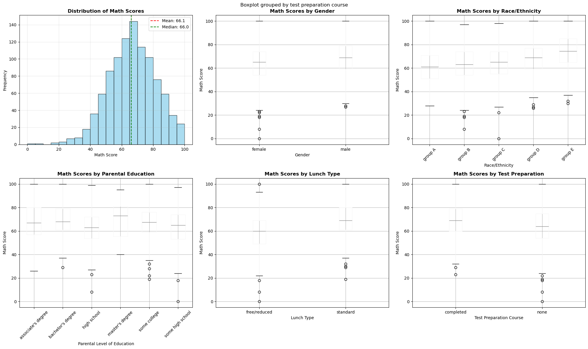
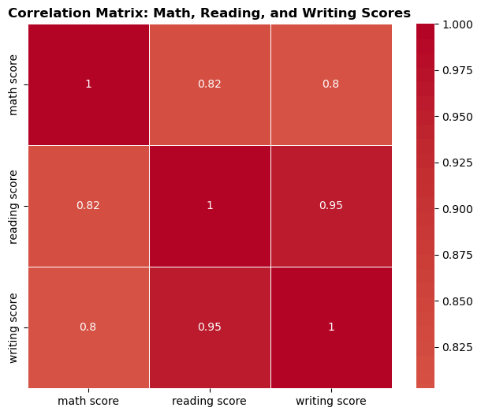
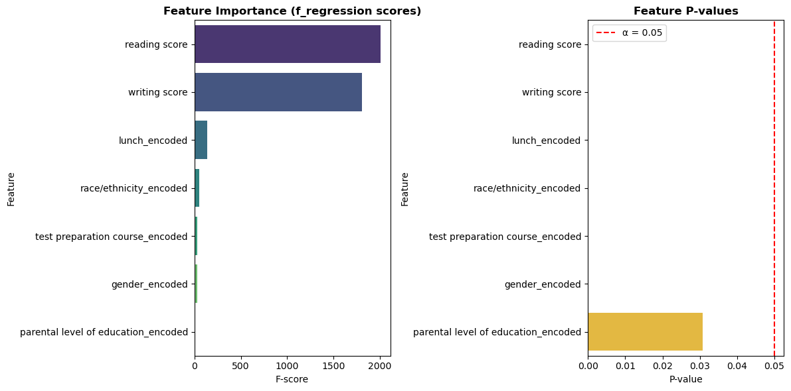
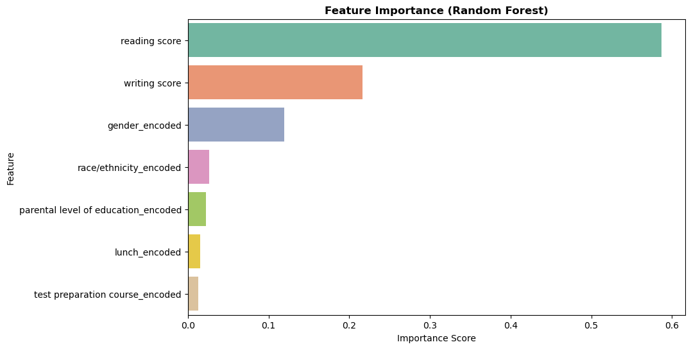
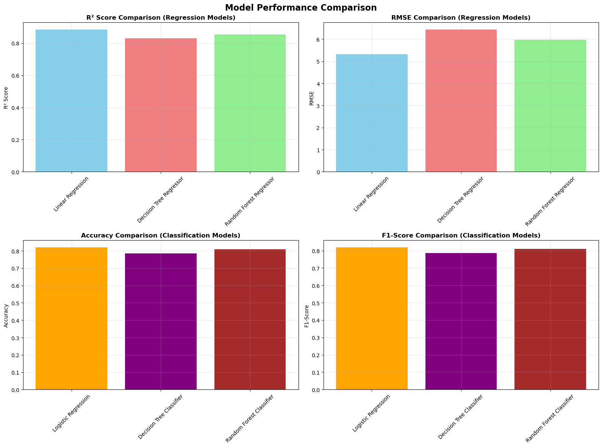
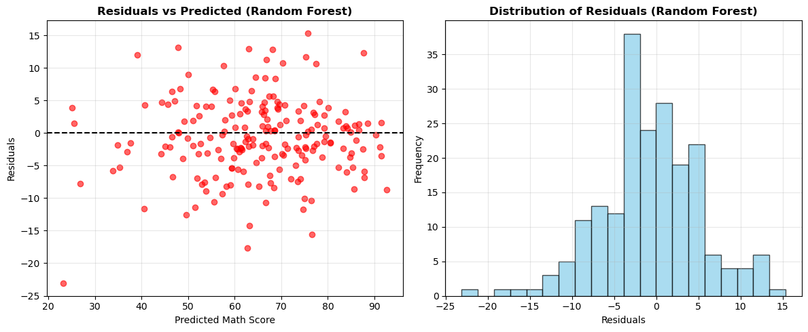
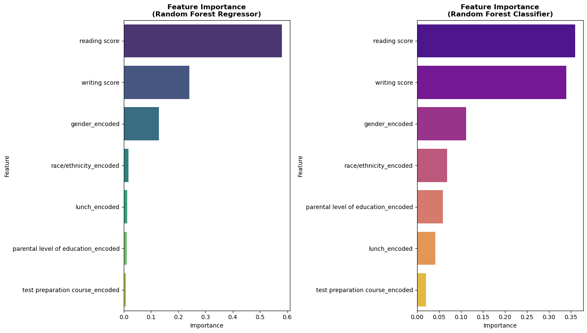

```python'''
# Student Performance Predictive Modeling
# Dataset: Student Performance in Exams from Kaggle
# URL: https://www.kaggle.com/spscientist/students-performance-in-exams
# 
# This notebook builds predictive models to predict math scores based on various student characteristics
# using supervised learning algorithms including Decision Trees, Logistic Regression, and Random Forest.

# =============================================================================
# 1. IMPORT NECESSARY LIBRARIES
# =============================================================================

# Data manipulation and analysis
import pandas as pd
import numpy as np

# Data visualization
import matplotlib.pyplot as plt
import seaborn as sns
from matplotlib.patches import Patch

# Machine learning libraries
from sklearn.model_selection import train_test_split, cross_val_score, GridSearchCV
from sklearn.preprocessing import LabelEncoder, StandardScaler
from sklearn.ensemble import RandomForestRegressor, RandomForestClassifier
from sklearn.tree import DecisionTreeRegressor, DecisionTreeClassifier
from sklearn.linear_model import LogisticRegression, LinearRegression
from sklearn.metrics import (accuracy_score, precision_score, recall_score, f1_score, 
                           classification_report, confusion_matrix, mean_squared_error, 
                           r2_score, mean_absolute_error)
from sklearn.feature_selection import SelectKBest, f_regression, RFE

# Statistical analysis
from scipy import stats
import warnings
warnings.filterwarnings('ignore')

# Set display options
pd.set_option('display.max_columns', None)
pd.set_option('display.width', None)

# Set plotting style
plt.style.use('default')
sns.set_palette("husl")

print("All necessary libraries imported successfully!")

```

    All necessary libraries imported successfully!
    


```python
# =============================================================================
# 2. DATA LOADING AND INITIAL EXPLORATION
# =============================================================================

# Load the dataset
# Note: Make sure you have downloaded the dataset from Kaggle and placed it in your working directory
# You can download it from: https://www.kaggle.com/spscientist/students-performance-in-exams

try:
    # Try to load the dataset (adjust the path as needed)
    df = pd.read_csv('StudentsPerformance.csv')
    print("Dataset loaded successfully!")
    print(f"Dataset shape: {df.shape}")
except FileNotFoundError:
    print("Dataset file not found. Please download 'StudentsPerformance.csv' from Kaggle and place it in your working directory.")
    print("Download link: https://www.kaggle.com/spscientist/students-performance-in-exams")
    # Create sample data for demonstration if file not found
    np.random.seed(42)
    sample_data = {
        'gender': np.random.choice(['female', 'male'], 1000),
        'race/ethnicity': np.random.choice(['group A', 'group B', 'group C', 'group D', 'group E'], 1000),
        'parental level of education': np.random.choice([
            'bachelor\'s degree', 'some college', 'master\'s degree', 
            'associate\'s degree', 'high school', 'some high school'
        ], 1000),
        'lunch': np.random.choice(['standard', 'free/reduced'], 1000),
        'test preparation course': np.random.choice(['none', 'completed'], 1000),
        'math score': np.random.randint(0, 101, 1000),
        'reading score': np.random.randint(0, 101, 1000),
        'writing score': np.random.randint(0, 101, 1000)
    }
    df = pd.DataFrame(sample_data)
    print("Using sample data for demonstration purposes.")

# Display basic information about the dataset
print("\n" + "="*50)
print("DATASET OVERVIEW")
print("="*50)
print(f"Dataset dimensions: {df.shape[0]} rows × {df.shape[1]} columns")
print(f"\nColumn names:")
for i, col in enumerate(df.columns, 1):
    print(f"{i}. {col}")

# Display first few rows
print(f"\nFirst 5 rows of the dataset:")
display(df.head())

# Display data types and missing values
print(f"\nData types and missing values:")
info_df = pd.DataFrame({
    'Column': df.columns,
    'Data Type': df.dtypes,
    'Non-Null Count': df.count(),
    'Null Count': df.isnull().sum(),
    'Null Percentage': (df.isnull().sum() / len(df) * 100).round(2)
})
display(info_df)

# Basic statistical summary
print(f"\nStatistical summary of numerical variables:")
display(df.describe())

```

    Dataset loaded successfully!
    Dataset shape: (1000, 8)
    
    ==================================================
    DATASET OVERVIEW
    ==================================================
    Dataset dimensions: 1000 rows × 8 columns
    
    Column names:
    1. gender
    2. race/ethnicity
    3. parental level of education
    4. lunch
    5. test preparation course
    6. math score
    7. reading score
    8. writing score
    
    First 5 rows of the dataset:
    


<div>
<style scoped>
    .dataframe tbody tr th:only-of-type {
        vertical-align: middle;
    }

    .dataframe tbody tr th {
        vertical-align: top;
    }

    .dataframe thead th {
        text-align: right;
    }
</style>
<table border="1" class="dataframe">
  <thead>
    <tr style="text-align: right;">
      <th></th>
      <th>gender</th>
      <th>race/ethnicity</th>
      <th>parental level of education</th>
      <th>lunch</th>
      <th>test preparation course</th>
      <th>math score</th>
      <th>reading score</th>
      <th>writing score</th>
    </tr>
  </thead>
  <tbody>
    <tr>
      <th>0</th>
      <td>female</td>
      <td>group B</td>
      <td>bachelor's degree</td>
      <td>standard</td>
      <td>none</td>
      <td>72</td>
      <td>72</td>
      <td>74</td>
    </tr>
    <tr>
      <th>1</th>
      <td>female</td>
      <td>group C</td>
      <td>some college</td>
      <td>standard</td>
      <td>completed</td>
      <td>69</td>
      <td>90</td>
      <td>88</td>
    </tr>
    <tr>
      <th>2</th>
      <td>female</td>
      <td>group B</td>
      <td>master's degree</td>
      <td>standard</td>
      <td>none</td>
      <td>90</td>
      <td>95</td>
      <td>93</td>
    </tr>
    <tr>
      <th>3</th>
      <td>male</td>
      <td>group A</td>
      <td>associate's degree</td>
      <td>free/reduced</td>
      <td>none</td>
      <td>47</td>
      <td>57</td>
      <td>44</td>
    </tr>
    <tr>
      <th>4</th>
      <td>male</td>
      <td>group C</td>
      <td>some college</td>
      <td>standard</td>
      <td>none</td>
      <td>76</td>
      <td>78</td>
      <td>75</td>
    </tr>
  </tbody>
</table>
</div>


    
    Data types and missing values:
    


<div>
<style scoped>
    .dataframe tbody tr th:only-of-type {
        vertical-align: middle;
    }

    .dataframe tbody tr th {
        vertical-align: top;
    }

    .dataframe thead th {
        text-align: right;
    }
</style>
<table border="1" class="dataframe">
  <thead>
    <tr style="text-align: right;">
      <th></th>
      <th>Column</th>
      <th>Data Type</th>
      <th>Non-Null Count</th>
      <th>Null Count</th>
      <th>Null Percentage</th>
    </tr>
  </thead>
  <tbody>
    <tr>
      <th>gender</th>
      <td>gender</td>
      <td>object</td>
      <td>1000</td>
      <td>0</td>
      <td>0.0</td>
    </tr>
    <tr>
      <th>race/ethnicity</th>
      <td>race/ethnicity</td>
      <td>object</td>
      <td>1000</td>
      <td>0</td>
      <td>0.0</td>
    </tr>
    <tr>
      <th>parental level of education</th>
      <td>parental level of education</td>
      <td>object</td>
      <td>1000</td>
      <td>0</td>
      <td>0.0</td>
    </tr>
    <tr>
      <th>lunch</th>
      <td>lunch</td>
      <td>object</td>
      <td>1000</td>
      <td>0</td>
      <td>0.0</td>
    </tr>
    <tr>
      <th>test preparation course</th>
      <td>test preparation course</td>
      <td>object</td>
      <td>1000</td>
      <td>0</td>
      <td>0.0</td>
    </tr>
    <tr>
      <th>math score</th>
      <td>math score</td>
      <td>int64</td>
      <td>1000</td>
      <td>0</td>
      <td>0.0</td>
    </tr>
    <tr>
      <th>reading score</th>
      <td>reading score</td>
      <td>int64</td>
      <td>1000</td>
      <td>0</td>
      <td>0.0</td>
    </tr>
    <tr>
      <th>writing score</th>
      <td>writing score</td>
      <td>int64</td>
      <td>1000</td>
      <td>0</td>
      <td>0.0</td>
    </tr>
  </tbody>
</table>
</div>


    
    Statistical summary of numerical variables:
    


<div>
<style scoped>
    .dataframe tbody tr th:only-of-type {
        vertical-align: middle;
    }

    .dataframe tbody tr th {
        vertical-align: top;
    }

    .dataframe thead th {
        text-align: right;
    }
</style>
<table border="1" class="dataframe">
  <thead>
    <tr style="text-align: right;">
      <th></th>
      <th>math score</th>
      <th>reading score</th>
      <th>writing score</th>
    </tr>
  </thead>
  <tbody>
    <tr>
      <th>count</th>
      <td>1000.00000</td>
      <td>1000.000000</td>
      <td>1000.000000</td>
    </tr>
    <tr>
      <th>mean</th>
      <td>66.08900</td>
      <td>69.169000</td>
      <td>68.054000</td>
    </tr>
    <tr>
      <th>std</th>
      <td>15.16308</td>
      <td>14.600192</td>
      <td>15.195657</td>
    </tr>
    <tr>
      <th>min</th>
      <td>0.00000</td>
      <td>17.000000</td>
      <td>10.000000</td>
    </tr>
    <tr>
      <th>25%</th>
      <td>57.00000</td>
      <td>59.000000</td>
      <td>57.750000</td>
    </tr>
    <tr>
      <th>50%</th>
      <td>66.00000</td>
      <td>70.000000</td>
      <td>69.000000</td>
    </tr>
    <tr>
      <th>75%</th>
      <td>77.00000</td>
      <td>79.000000</td>
      <td>79.000000</td>
    </tr>
    <tr>
      <th>max</th>
      <td>100.00000</td>
      <td>100.000000</td>
      <td>100.000000</td>
    </tr>
  </tbody>
</table>
</div>


```python
# =============================================================================
# 3. EXPLORATORY DATA ANALYSIS (EDA)
# =============================================================================

print("\n" + "="*50)
print("EXPLORATORY DATA ANALYSIS")
print("="*50)

# Create figure for EDA plots
fig, axes = plt.subplots(2, 3, figsize=(20, 12))
fig.suptitle('Student Performance - Exploratory Data Analysis', fontsize=16, fontweight='bold')

# 1. Distribution of Math Scores
axes[0, 0].hist(df['math score'], bins=20, alpha=0.7, color='skyblue', edgecolor='black')
axes[0, 0].set_title('Distribution of Math Scores', fontweight='bold')
axes[0, 0].set_xlabel('Math Score')
axes[0, 0].set_ylabel('Frequency')
axes[0, 0].grid(True, alpha=0.3)

# Add statistics to the plot
mean_math = df['math score'].mean()
median_math = df['math score'].median()
axes[0, 0].axvline(mean_math, color='red', linestyle='--', label=f'Mean: {mean_math:.1f}')
axes[0, 0].axvline(median_math, color='green', linestyle='--', label=f'Median: {median_math:.1f}')
axes[0, 0].legend()

# 2. Math Scores by Gender
df.boxplot(column='math score', by='gender', ax=axes[0, 1])
axes[0, 1].set_title('Math Scores by Gender', fontweight='bold')
axes[0, 1].set_xlabel('Gender')
axes[0, 1].set_ylabel('Math Score')

# 3. Math Scores by Race/Ethnicity
df.boxplot(column='math score', by='race/ethnicity', ax=axes[0, 2])
axes[0, 2].set_title('Math Scores by Race/Ethnicity', fontweight='bold')
axes[0, 2].set_xlabel('Race/Ethnicity')
axes[0, 2].set_ylabel('Math Score')
axes[0, 2].tick_params(axis='x', rotation=45)

# 4. Math Scores by Parental Education
df.boxplot(column='math score', by='parental level of education', ax=axes[1, 0])
axes[1, 0].set_title('Math Scores by Parental Education', fontweight='bold')
axes[1, 0].set_xlabel('Parental Level of Education')
axes[1, 0].set_ylabel('Math Score')
axes[1, 0].tick_params(axis='x', rotation=45)

# 5. Math Scores by Lunch Type
df.boxplot(column='math score', by='lunch', ax=axes[1, 1])
axes[1, 1].set_title('Math Scores by Lunch Type', fontweight='bold')
axes[1, 1].set_xlabel('Lunch Type')
axes[1, 1].set_ylabel('Math Score')

# 6. Math Scores by Test Preparation
df.boxplot(column='math score', by='test preparation course', ax=axes[1, 2])
axes[1, 2].set_title('Math Scores by Test Preparation', fontweight='bold')
axes[1, 2].set_xlabel('Test Preparation Course')
axes[1, 2].set_ylabel('Math Score')

plt.tight_layout()
plt.show()
```

    
    ==================================================
    EXPLORATORY DATA ANALYSIS
    ==================================================
    


    

    


```python
# Correlation analysis between all score types
print("\nCorrelation between different scores:")
score_columns = ['math score', 'reading score', 'writing score']
correlation_matrix = df[score_columns].corr()
display(correlation_matrix)

# Visualize correlation matrix
plt.figure(figsize=(8, 6))
sns.heatmap(correlation_matrix, annot=True, cmap='coolwarm', center=0, 
            square=True, linewidths=0.5)
plt.title('Correlation Matrix: Math, Reading, and Writing Scores', fontweight='bold')
plt.show()

```

    
    Correlation between different scores:
    


<div>
<style scoped>
    .dataframe tbody tr th:only-of-type {
        vertical-align: middle;
    }

    .dataframe tbody tr th {
        vertical-align: top;
    }

    .dataframe thead th {
        text-align: right;
    }
</style>
<table border="1" class="dataframe">
  <thead>
    <tr style="text-align: right;">
      <th></th>
      <th>math score</th>
      <th>reading score</th>
      <th>writing score</th>
    </tr>
  </thead>
  <tbody>
    <tr>
      <th>math score</th>
      <td>1.000000</td>
      <td>0.817580</td>
      <td>0.802642</td>
    </tr>
    <tr>
      <th>reading score</th>
      <td>0.817580</td>
      <td>1.000000</td>
      <td>0.954598</td>
    </tr>
    <tr>
      <th>writing score</th>
      <td>0.802642</td>
      <td>0.954598</td>
      <td>1.000000</td>
    </tr>
  </tbody>
</table>
</div>


    

    


```python
# Statistical analysis of math scores by categorical variables
print("\nStatistical Analysis of Math Scores by Categories:")
print("-" * 50)

categorical_vars = ['gender', 'race/ethnicity', 'parental level of education', 'lunch', 'test preparation course']

for var in categorical_vars:
    print(f"\n{var.upper()}:")
    stats_by_category = df.groupby(var)['math score'].agg(['mean', 'median', 'std', 'count']).round(2)
    display(stats_by_category)
    
```

    
    Statistical Analysis of Math Scores by Categories:
    --------------------------------------------------
    
    GENDER:
    


<div>
<style scoped>
    .dataframe tbody tr th:only-of-type {
        vertical-align: middle;
    }

    .dataframe tbody tr th {
        vertical-align: top;
    }

    .dataframe thead th {
        text-align: right;
    }
</style>
<table border="1" class="dataframe">
  <thead>
    <tr style="text-align: right;">
      <th></th>
      <th>mean</th>
      <th>median</th>
      <th>std</th>
      <th>count</th>
    </tr>
    <tr>
      <th>gender</th>
      <th></th>
      <th></th>
      <th></th>
      <th></th>
    </tr>
  </thead>
  <tbody>
    <tr>
      <th>female</th>
      <td>63.63</td>
      <td>65.0</td>
      <td>15.49</td>
      <td>518</td>
    </tr>
    <tr>
      <th>male</th>
      <td>68.73</td>
      <td>69.0</td>
      <td>14.36</td>
      <td>482</td>
    </tr>
  </tbody>
</table>
</div>


    
    RACE/ETHNICITY:
    


<div>
<style scoped>
    .dataframe tbody tr th:only-of-type {
        vertical-align: middle;
    }

    .dataframe tbody tr th {
        vertical-align: top;
    }

    .dataframe thead th {
        text-align: right;
    }
</style>
<table border="1" class="dataframe">
  <thead>
    <tr style="text-align: right;">
      <th></th>
      <th>mean</th>
      <th>median</th>
      <th>std</th>
      <th>count</th>
    </tr>
    <tr>
      <th>race/ethnicity</th>
      <th></th>
      <th></th>
      <th></th>
      <th></th>
    </tr>
  </thead>
  <tbody>
    <tr>
      <th>group A</th>
      <td>61.63</td>
      <td>61.0</td>
      <td>14.52</td>
      <td>89</td>
    </tr>
    <tr>
      <th>group B</th>
      <td>63.45</td>
      <td>63.0</td>
      <td>15.47</td>
      <td>190</td>
    </tr>
    <tr>
      <th>group C</th>
      <td>64.46</td>
      <td>65.0</td>
      <td>14.85</td>
      <td>319</td>
    </tr>
    <tr>
      <th>group D</th>
      <td>67.36</td>
      <td>69.0</td>
      <td>13.77</td>
      <td>262</td>
    </tr>
    <tr>
      <th>group E</th>
      <td>73.82</td>
      <td>74.5</td>
      <td>15.53</td>
      <td>140</td>
    </tr>
  </tbody>
</table>
</div>


    
    PARENTAL LEVEL OF EDUCATION:
    


<div>
<style scoped>
    .dataframe tbody tr th:only-of-type {
        vertical-align: middle;
    }

    .dataframe tbody tr th {
        vertical-align: top;
    }

    .dataframe thead th {
        text-align: right;
    }
</style>
<table border="1" class="dataframe">
  <thead>
    <tr style="text-align: right;">
      <th></th>
      <th>mean</th>
      <th>median</th>
      <th>std</th>
      <th>count</th>
    </tr>
    <tr>
      <th>parental level of education</th>
      <th></th>
      <th></th>
      <th></th>
      <th></th>
    </tr>
  </thead>
  <tbody>
    <tr>
      <th>associate's degree</th>
      <td>67.88</td>
      <td>67.0</td>
      <td>15.11</td>
      <td>222</td>
    </tr>
    <tr>
      <th>bachelor's degree</th>
      <td>69.39</td>
      <td>68.0</td>
      <td>14.94</td>
      <td>118</td>
    </tr>
    <tr>
      <th>high school</th>
      <td>62.14</td>
      <td>63.0</td>
      <td>14.54</td>
      <td>196</td>
    </tr>
    <tr>
      <th>master's degree</th>
      <td>69.75</td>
      <td>73.0</td>
      <td>15.15</td>
      <td>59</td>
    </tr>
    <tr>
      <th>some college</th>
      <td>67.13</td>
      <td>67.5</td>
      <td>14.31</td>
      <td>226</td>
    </tr>
    <tr>
      <th>some high school</th>
      <td>63.50</td>
      <td>65.0</td>
      <td>15.93</td>
      <td>179</td>
    </tr>
  </tbody>
</table>
</div>


    
    LUNCH:
    


<div>
<style scoped>
    .dataframe tbody tr th:only-of-type {
        vertical-align: middle;
    }

    .dataframe tbody tr th {
        vertical-align: top;
    }

    .dataframe thead th {
        text-align: right;
    }
</style>
<table border="1" class="dataframe">
  <thead>
    <tr style="text-align: right;">
      <th></th>
      <th>mean</th>
      <th>median</th>
      <th>std</th>
      <th>count</th>
    </tr>
    <tr>
      <th>lunch</th>
      <th></th>
      <th></th>
      <th></th>
      <th></th>
    </tr>
  </thead>
  <tbody>
    <tr>
      <th>free/reduced</th>
      <td>58.92</td>
      <td>60.0</td>
      <td>15.16</td>
      <td>355</td>
    </tr>
    <tr>
      <th>standard</th>
      <td>70.03</td>
      <td>69.0</td>
      <td>13.65</td>
      <td>645</td>
    </tr>
  </tbody>
</table>
</div>


    
    TEST PREPARATION COURSE:
    


<div>
<style scoped>
    .dataframe tbody tr th:only-of-type {
        vertical-align: middle;
    }

    .dataframe tbody tr th {
        vertical-align: top;
    }

    .dataframe thead th {
        text-align: right;
    }
</style>
<table border="1" class="dataframe">
  <thead>
    <tr style="text-align: right;">
      <th></th>
      <th>mean</th>
      <th>median</th>
      <th>std</th>
      <th>count</th>
    </tr>
    <tr>
      <th>test preparation course</th>
      <th></th>
      <th></th>
      <th></th>
      <th></th>
    </tr>
  </thead>
  <tbody>
    <tr>
      <th>completed</th>
      <td>69.70</td>
      <td>69.0</td>
      <td>14.44</td>
      <td>358</td>
    </tr>
    <tr>
      <th>none</th>
      <td>64.08</td>
      <td>64.0</td>
      <td>15.19</td>
      <td>642</td>
    </tr>
  </tbody>
</table>
</div>


```python
  # Perform ANOVA test to check if there are significant differences
groups = [group['math score'].values for name, group in df.groupby(var)]
f_stat, p_value = stats.f_oneway(*groups)
print(f"ANOVA F-statistic: {f_stat:.4f}, p-value: {p_value:.4f}")
if p_value < 0.05:
    print("✓ Significant differences detected between groups")
else:
    print("✗ No significant differences between groups")

```

    ANOVA F-statistic: 32.5426, p-value: 0.0000
    ✓ Significant differences detected between groups
    


```python
# =============================================================================
# 4. DATA PREPROCESSING
# =============================================================================

print("\n" + "="*50)
print("DATA PREPROCESSING")
print("="*50)

# Create a copy of the original dataset for preprocessing
df_processed = df.copy()

# Display unique values for categorical variables
print("Unique values in categorical variables:")
categorical_columns = df_processed.select_dtypes(include=['object']).columns
for col in categorical_columns:
    print(f"\n{col}: {df_processed[col].unique()}")

# Encode categorical variables using Label Encoder
print(f"\nEncoding categorical variables...")
label_encoders = {}
for col in categorical_columns:
    if col != 'math score':  # Don't encode target variable if it's categorical
        le = LabelEncoder()
        df_processed[col + '_encoded'] = le.fit_transform(df_processed[col])
        label_encoders[col] = le
        print(f"✓ Encoded {col}")

# Create mapping dictionaries for interpretability
print(f"\nEncoding mappings:")
for col, encoder in label_encoders.items():
    mapping = dict(zip(encoder.classes_, encoder.transform(encoder.classes_)))
    print(f"\n{col}:")
    for original, encoded in mapping.items():
        print(f"  {original} → {encoded}")

# Prepare features (X) and target variable (y)
feature_columns = [col for col in df_processed.columns if col.endswith('_encoded')] + ['reading score', 'writing score']
X = df_processed[feature_columns]
y = df_processed['math score']

print(f"\nFeature columns selected: {feature_columns}")
print(f"Feature matrix shape: {X.shape}")
print(f"Target variable shape: {y.shape}")

# Display the processed features
print(f"\nProcessed feature matrix (first 5 rows):")
display(X.head())
```

    
    ==================================================
    DATA PREPROCESSING
    ==================================================
    Unique values in categorical variables:
    
    gender: ['female' 'male']
    
    race/ethnicity: ['group B' 'group C' 'group A' 'group D' 'group E']
    
    parental level of education: ["bachelor's degree" 'some college' "master's degree" "associate's degree"
     'high school' 'some high school']
    
    lunch: ['standard' 'free/reduced']
    
    test preparation course: ['none' 'completed']
    
    Encoding categorical variables...
    ✓ Encoded gender
    ✓ Encoded race/ethnicity
    ✓ Encoded parental level of education
    ✓ Encoded lunch
    ✓ Encoded test preparation course
    
    Encoding mappings:
    
    gender:
      female → 0
      male → 1
    
    race/ethnicity:
      group A → 0
      group B → 1
      group C → 2
      group D → 3
      group E → 4
    
    parental level of education:
      associate's degree → 0
      bachelor's degree → 1
      high school → 2
      master's degree → 3
      some college → 4
      some high school → 5
    
    lunch:
      free/reduced → 0
      standard → 1
    
    test preparation course:
      completed → 0
      none → 1
    
    Feature columns selected: ['gender_encoded', 'race/ethnicity_encoded', 'parental level of education_encoded', 'lunch_encoded', 'test preparation course_encoded', 'reading score', 'writing score']
    Feature matrix shape: (1000, 7)
    Target variable shape: (1000,)
    
    Processed feature matrix (first 5 rows):
    


<div>
<style scoped>
    .dataframe tbody tr th:only-of-type {
        vertical-align: middle;
    }

    .dataframe tbody tr th {
        vertical-align: top;
    }

    .dataframe thead th {
        text-align: right;
    }
</style>
<table border="1" class="dataframe">
  <thead>
    <tr style="text-align: right;">
      <th></th>
      <th>gender_encoded</th>
      <th>race/ethnicity_encoded</th>
      <th>parental level of education_encoded</th>
      <th>lunch_encoded</th>
      <th>test preparation course_encoded</th>
      <th>reading score</th>
      <th>writing score</th>
    </tr>
  </thead>
  <tbody>
    <tr>
      <th>0</th>
      <td>0</td>
      <td>1</td>
      <td>1</td>
      <td>1</td>
      <td>1</td>
      <td>72</td>
      <td>74</td>
    </tr>
    <tr>
      <th>1</th>
      <td>0</td>
      <td>2</td>
      <td>4</td>
      <td>1</td>
      <td>0</td>
      <td>90</td>
      <td>88</td>
    </tr>
    <tr>
      <th>2</th>
      <td>0</td>
      <td>1</td>
      <td>3</td>
      <td>1</td>
      <td>1</td>
      <td>95</td>
      <td>93</td>
    </tr>
    <tr>
      <th>3</th>
      <td>1</td>
      <td>0</td>
      <td>0</td>
      <td>0</td>
      <td>1</td>
      <td>57</td>
      <td>44</td>
    </tr>
    <tr>
      <th>4</th>
      <td>1</td>
      <td>2</td>
      <td>4</td>
      <td>1</td>
      <td>1</td>
      <td>78</td>
      <td>75</td>
    </tr>
  </tbody>
</table>
</div>


```python
# =============================================================================
# 5. FEATURE SELECTION
# =============================================================================

print("\n" + "="*50)
print("FEATURE SELECTION")
print("="*50)

# Method 1: Statistical Feature Selection using f_regression
print("1. Statistical Feature Selection (f_regression)")
print("-" * 40)

# Select top k features based on f_regression scores
selector_stats = SelectKBest(score_func=f_regression, k='all')
X_stats = selector_stats.fit_transform(X, y)


```

    
    ==================================================
    FEATURE SELECTION
    ==================================================
    1. Statistical Feature Selection (f_regression)
    ----------------------------------------
    


```python
# Get feature scores and create a DataFrame for better visualization
feature_scores = pd.DataFrame({
    'Feature': X.columns,
    'Score': selector_stats.scores_,
    'P_value': selector_stats.pvalues_
}).sort_values('Score', ascending=False)

print("Feature importance based on f_regression scores:")
display(feature_scores)

# Visualize feature importance
plt.figure(figsize=(12, 6))
plt.subplot(1, 2, 1)
sns.barplot(data=feature_scores, y='Feature', x='Score', palette='viridis')
plt.title('Feature Importance (f_regression scores)', fontweight='bold')
plt.xlabel('F-score')

plt.subplot(1, 2, 2)
sns.barplot(data=feature_scores, y='Feature', x='P_value', palette='plasma')
plt.title('Feature P-values', fontweight='bold')
plt.xlabel('P-value')
plt.axvline(x=0.05, color='red', linestyle='--', label='α = 0.05')
plt.legend()

plt.tight_layout()
plt.show()

```

    Feature importance based on f_regression scores:
    


<div>
<style scoped>
    .dataframe tbody tr th:only-of-type {
        vertical-align: middle;
    }

    .dataframe tbody tr th {
        vertical-align: top;
    }

    .dataframe thead th {
        text-align: right;
    }
</style>
<table border="1" class="dataframe">
  <thead>
    <tr style="text-align: right;">
      <th></th>
      <th>Feature</th>
      <th>Score</th>
      <th>P_value</th>
    </tr>
  </thead>
  <tbody>
    <tr>
      <th>5</th>
      <td>reading score</td>
      <td>2011.981555</td>
      <td>1.787753e-241</td>
    </tr>
    <tr>
      <th>6</th>
      <td>writing score</td>
      <td>1807.216666</td>
      <td>3.376027e-226</td>
    </tr>
    <tr>
      <th>3</th>
      <td>lunch_encoded</td>
      <td>140.118842</td>
      <td>2.413196e-30</td>
    </tr>
    <tr>
      <th>1</th>
      <td>race/ethnicity_encoded</td>
      <td>49.038736</td>
      <td>4.605501e-12</td>
    </tr>
    <tr>
      <th>4</th>
      <td>test preparation course_encoded</td>
      <td>32.542648</td>
      <td>1.535913e-08</td>
    </tr>
    <tr>
      <th>0</th>
      <td>gender_encoded</td>
      <td>28.979336</td>
      <td>9.120186e-08</td>
    </tr>
    <tr>
      <th>2</th>
      <td>parental level of education_encoded</td>
      <td>4.674527</td>
      <td>3.085021e-02</td>
    </tr>
  </tbody>
</table>
</div>


    

    


```python
# Method 2: Random Forest Feature Importance
print(f"\n2. Random Forest Feature Importance")
print("-" * 40)

# Create a Random Forest model for feature importance
rf_feature_selector = RandomForestRegressor(n_estimators=100, random_state=42)
rf_feature_selector.fit(X, y)

# Get feature importances
rf_importance = pd.DataFrame({
    'Feature': X.columns,
    'Importance': rf_feature_selector.feature_importances_
}).sort_values('Importance', ascending=False)

print("Feature importance based on Random Forest:")
display(rf_importance)

# Visualize Random Forest feature importance
plt.figure(figsize=(10, 6))
sns.barplot(data=rf_importance, y='Feature', x='Importance', palette='Set2')
plt.title('Feature Importance (Random Forest)', fontweight='bold')
plt.xlabel('Importance Score')
plt.show()

# Select top features based on importance threshold
importance_threshold = 0.05  # Select features with importance > 5%
important_features = rf_importance[rf_importance['Importance'] > importance_threshold]['Feature'].tolist()
print(f"\nSelected features (importance > {importance_threshold}): {important_features}")

```

    
    2. Random Forest Feature Importance
    ----------------------------------------
    Feature importance based on Random Forest:
    


<div>
<style scoped>
    .dataframe tbody tr th:only-of-type {
        vertical-align: middle;
    }

    .dataframe tbody tr th {
        vertical-align: top;
    }

    .dataframe thead th {
        text-align: right;
    }
</style>
<table border="1" class="dataframe">
  <thead>
    <tr style="text-align: right;">
      <th></th>
      <th>Feature</th>
      <th>Importance</th>
    </tr>
  </thead>
  <tbody>
    <tr>
      <th>5</th>
      <td>reading score</td>
      <td>0.586876</td>
    </tr>
    <tr>
      <th>6</th>
      <td>writing score</td>
      <td>0.216318</td>
    </tr>
    <tr>
      <th>0</th>
      <td>gender_encoded</td>
      <td>0.119559</td>
    </tr>
    <tr>
      <th>1</th>
      <td>race/ethnicity_encoded</td>
      <td>0.026770</td>
    </tr>
    <tr>
      <th>2</th>
      <td>parental level of education_encoded</td>
      <td>0.022430</td>
    </tr>
    <tr>
      <th>3</th>
      <td>lunch_encoded</td>
      <td>0.015267</td>
    </tr>
    <tr>
      <th>4</th>
      <td>test preparation course_encoded</td>
      <td>0.012780</td>
    </tr>
  </tbody>
</table>
</div>


    

    


    
    Selected features (importance > 0.05): ['reading score', 'writing score', 'gender_encoded']
    


```python
# =============================================================================
# 6. MODEL BUILDING AND TRAINING
# =============================================================================

print("\n" + "="*50)
print("MODEL BUILDING AND TRAINING")
print("="*50)

# Split the data into training and testing sets
X_train, X_test, y_train, y_test = train_test_split(
    X, y, test_size=0.2, random_state=42, stratify=None
)

print(f"Training set size: {X_train.shape[0]} samples")
print(f"Testing set size: {X_test.shape[0]} samples")

# For classification tasks, we'll create categorical versions of math scores
# Define score categories: Low (0-60), Medium (61-80), High (81-100)
def categorize_score(score):
    if score <= 60:
        return 'Low'
    elif score <= 80:
        return 'Medium'
    else:
        return 'High'

y_train_cat = y_train.apply(categorize_score)
y_test_cat = y_test.apply(categorize_score)

print(f"\nScore categories distribution in training set:")
print(y_train_cat.value_counts())

# Initialize models dictionary to store all models
models = {}
model_results = {}
```

    
    ==================================================
    MODEL BUILDING AND TRAINING
    ==================================================
    Training set size: 800 samples
    Testing set size: 200 samples
    
    Score categories distribution in training set:
    math score
    Medium    390
    Low       265
    High      145
    Name: count, dtype: int64
    


```python
# =============================================================================
# MODEL 1: LINEAR REGRESSION (Baseline for regression)
# =============================================================================

print(f"\n1. LINEAR REGRESSION MODEL")
print("-" * 30)

# Train Linear Regression model
lr_model = LinearRegression()
lr_model.fit(X_train, y_train)
models['Linear Regression'] = lr_model

# Make predictions
y_pred_lr = lr_model.predict(X_test)

# Calculate regression metrics
lr_mse = mean_squared_error(y_test, y_pred_lr)
lr_rmse = np.sqrt(lr_mse)
lr_mae = mean_absolute_error(y_test, y_pred_lr)
lr_r2 = r2_score(y_test, y_pred_lr)

model_results['Linear Regression'] = {
    'MSE': lr_mse,
    'RMSE': lr_rmse,
    'MAE': lr_mae,
    'R²': lr_r2
}

print(f"Linear Regression Results:")
print(f"  Mean Squared Error (MSE): {lr_mse:.4f}")
print(f"  Root Mean Squared Error (RMSE): {lr_rmse:.4f}")
print(f"  Mean Absolute Error (MAE): {lr_mae:.4f}")
print(f"  R² Score: {lr_r2:.4f}")

```

    
    1. LINEAR REGRESSION MODEL
    ------------------------------
    Linear Regression Results:
      Mean Squared Error (MSE): 28.2753
      Root Mean Squared Error (RMSE): 5.3175
      Mean Absolute Error (MAE): 4.1301
      R² Score: 0.8838
    


```python
# =============================================================================
# MODEL 2: DECISION TREE REGRESSOR
# =============================================================================

print(f"\n2. DECISION TREE REGRESSOR")
print("-" * 30)

# Train Decision Tree model with hyperparameter tuning
dt_params = {
    'max_depth': [3, 5, 7, 10, None],
    'min_samples_split': [2, 5, 10],
    'min_samples_leaf': [1, 2, 4]
}

dt_regressor = DecisionTreeRegressor(random_state=42)
dt_grid = GridSearchCV(dt_regressor, dt_params, cv=5, scoring='r2', n_jobs=-1)
dt_grid.fit(X_train, y_train)

# Best model
best_dt_regressor = dt_grid.best_estimator_
models['Decision Tree Regressor'] = best_dt_regressor

print(f"Best Decision Tree parameters: {dt_grid.best_params_}")

# Make predictions
y_pred_dt = best_dt_regressor.predict(X_test)

# Calculate metrics
dt_mse = mean_squared_error(y_test, y_pred_dt)
dt_rmse = np.sqrt(dt_mse)
dt_mae = mean_absolute_error(y_test, y_pred_dt)
dt_r2 = r2_score(y_test, y_pred_dt)

model_results['Decision Tree Regressor'] = {
    'MSE': dt_mse,
    'RMSE': dt_rmse,
    'MAE': dt_mae,
    'R²': dt_r2
}

print(f"Decision Tree Regressor Results:")
print(f"  Mean Squared Error (MSE): {dt_mse:.4f}")
print(f"  Root Mean Squared Error (RMSE): {dt_rmse:.4f}")
print(f"  Mean Absolute Error (MAE): {dt_mae:.4f}")
print(f"  R² Score: {dt_r2:.4f}")
```

    
    2. DECISION TREE REGRESSOR
    ------------------------------
    Best Decision Tree parameters: {'max_depth': 7, 'min_samples_leaf': 4, 'min_samples_split': 10}
    Decision Tree Regressor Results:
      Mean Squared Error (MSE): 41.3810
      Root Mean Squared Error (RMSE): 6.4328
      Mean Absolute Error (MAE): 4.9967
      R² Score: 0.8299
    


```python
# =============================================================================
# MODEL 3: RANDOM FOREST REGRESSOR
# =============================================================================

print(f"\n3. RANDOM FOREST REGRESSOR")
print("-" * 30)

# Train Random Forest model with hyperparameter tuning
rf_params = {
    'n_estimators': [50, 100, 200],
    'max_depth': [5, 10, 15, None],
    'min_samples_split': [2, 5, 10]
}

rf_regressor = RandomForestRegressor(random_state=42)
rf_grid = GridSearchCV(rf_regressor, rf_params, cv=5, scoring='r2', n_jobs=-1)
rf_grid.fit(X_train, y_train)

# Best model
best_rf_regressor = rf_grid.best_estimator_
models['Random Forest Regressor'] = best_rf_regressor

print(f"Best Random Forest parameters: {rf_grid.best_params_}")

# Make predictions
y_pred_rf = best_rf_regressor.predict(X_test)

# Calculate metrics
rf_mse = mean_squared_error(y_test, y_pred_rf)
rf_rmse = np.sqrt(rf_mse)
rf_mae = mean_absolute_error(y_test, y_pred_rf)
rf_r2 = r2_score(y_test, y_pred_rf)

model_results['Random Forest Regressor'] = {
    'MSE': rf_mse,
    'RMSE': rf_rmse,
    'MAE': rf_mae,
    'R²': rf_r2
}

print(f"Random Forest Regressor Results:")
print(f"  Mean Squared Error (MSE): {rf_mse:.4f}")
print(f"  Root Mean Squared Error (RMSE): {rf_rmse:.4f}")
print(f"  Mean Absolute Error (MAE): {rf_mae:.4f}")
print(f"  R² Score: {rf_r2:.4f}")

```

    
    3. RANDOM FOREST REGRESSOR
    ------------------------------
    Best Random Forest parameters: {'max_depth': 10, 'min_samples_split': 10, 'n_estimators': 200}
    Random Forest Regressor Results:
      Mean Squared Error (MSE): 35.7511
      Root Mean Squared Error (RMSE): 5.9792
      Mean Absolute Error (MAE): 4.5834
      R² Score: 0.8531
    


```python
# =============================================================================
# CLASSIFICATION MODELS (for categorical math scores)
# =============================================================================

print(f"\n4. LOGISTIC REGRESSION (Classification)")
print("-" * 40)

# Scale features for logistic regression
scaler = StandardScaler()
X_train_scaled = scaler.fit_transform(X_train)
X_test_scaled = scaler.transform(X_test)

# Train Logistic Regression
log_reg = LogisticRegression(random_state=42, max_iter=1000, multi_class='ovr')
log_reg.fit(X_train_scaled, y_train_cat)
models['Logistic Regression'] = log_reg

# Make predictions
y_pred_log = log_reg.predict(X_test_scaled)
y_pred_log_proba = log_reg.predict_proba(X_test_scaled)

# Calculate classification metrics
log_accuracy = accuracy_score(y_test_cat, y_pred_log)
log_precision = precision_score(y_test_cat, y_pred_log, average='weighted', zero_division=0)
log_recall = recall_score(y_test_cat, y_pred_log, average='weighted', zero_division=0)
log_f1 = f1_score(y_test_cat, y_pred_log, average='weighted', zero_division=0)

model_results['Logistic Regression'] = {
    'Accuracy': log_accuracy,
    'Precision': log_precision,
    'Recall': log_recall,
    'F1-Score': log_f1
}

print(f"Logistic Regression Results:")
print(f"  Accuracy: {log_accuracy:.4f}")
print(f"  Precision: {log_precision:.4f}")
print(f"  Recall: {log_recall:.4f}")
print(f"  F1-Score: {log_f1:.4f}")
```

    
    4. LOGISTIC REGRESSION (Classification)
    ----------------------------------------
    Logistic Regression Results:
      Accuracy: 0.8200
      Precision: 0.8213
      Recall: 0.8200
      F1-Score: 0.8187
    


```python
# =============================================================================
# MODEL 5: DECISION TREE CLASSIFIER
# =============================================================================

print(f"\n5. DECISION TREE CLASSIFIER")
print("-" * 30)

# Train Decision Tree Classifier
dt_classifier = DecisionTreeClassifier(random_state=42)
dt_class_grid = GridSearchCV(dt_classifier, dt_params, cv=5, scoring='accuracy', n_jobs=-1)
dt_class_grid.fit(X_train, y_train_cat)

best_dt_classifier = dt_class_grid.best_estimator_
models['Decision Tree Classifier'] = best_dt_classifier

print(f"Best Decision Tree Classifier parameters: {dt_class_grid.best_params_}")

# Make predictions
y_pred_dt_class = best_dt_classifier.predict(X_test)

# Calculate metrics
dt_class_accuracy = accuracy_score(y_test_cat, y_pred_dt_class)
dt_class_precision = precision_score(y_test_cat, y_pred_dt_class, average='weighted', zero_division=0)
dt_class_recall = recall_score(y_test_cat, y_pred_dt_class, average='weighted', zero_division=0)
dt_class_f1 = f1_score(y_test_cat, y_pred_dt_class, average='weighted', zero_division=0)

model_results['Decision Tree Classifier'] = {
    'Accuracy': dt_class_accuracy,
    'Precision': dt_class_precision,
    'Recall': dt_class_recall,
    'F1-Score': dt_class_f1
}

print(f"Decision Tree Classifier Results:")
print(f"  Accuracy: {dt_class_accuracy:.4f}")
print(f"  Precision: {dt_class_precision:.4f}")
print(f"  Recall: {dt_class_recall:.4f}")
print(f"  F1-Score: {dt_class_f1:.4f}")

```

    
    5. DECISION TREE CLASSIFIER
    ------------------------------
    Best Decision Tree Classifier parameters: {'max_depth': 7, 'min_samples_leaf': 4, 'min_samples_split': 10}
    Decision Tree Classifier Results:
      Accuracy: 0.7850
      Precision: 0.7861
      Recall: 0.7850
      F1-Score: 0.7850
    


```python
# =============================================================================
# MODEL 6: RANDOM FOREST CLASSIFIER
# =============================================================================

print(f"\n6. RANDOM FOREST CLASSIFIER")
print("-" * 30)

# Train Random Forest Classifier
rf_classifier = RandomForestClassifier(random_state=42)
rf_class_grid = GridSearchCV(rf_classifier, rf_params, cv=5, scoring='accuracy', n_jobs=-1)
rf_class_grid.fit(X_train, y_train_cat)

best_rf_classifier = rf_class_grid.best_estimator_
models['Random Forest Classifier'] = best_rf_classifier

print(f"Best Random Forest Classifier parameters: {rf_class_grid.best_params_}")

# Make predictions
y_pred_rf_class = best_rf_classifier.predict(X_test)

# Calculate metrics
rf_class_accuracy = accuracy_score(y_test_cat, y_pred_rf_class)
rf_class_precision = precision_score(y_test_cat, y_pred_rf_class, average='weighted', zero_division=0)
rf_class_recall = recall_score(y_test_cat, y_pred_rf_class, average='weighted', zero_division=0)
rf_class_f1 = f1_score(y_test_cat, y_pred_rf_class, average='weighted', zero_division=0)

model_results['Random Forest Classifier'] = {
    'Accuracy': rf_class_accuracy,
    'Precision': rf_class_precision,
    'Recall': rf_class_recall,
    'F1-Score': rf_class_f1
}

print(f"Random Forest Classifier Results:")
print(f"  Accuracy: {rf_class_accuracy:.4f}")
print(f"  Precision: {rf_class_precision:.4f}")
print(f"  Recall: {rf_class_recall:.4f}")
print(f"  F1-Score: {rf_class_f1:.4f}")
```

    
    6. RANDOM FOREST CLASSIFIER
    ------------------------------
    Best Random Forest Classifier parameters: {'max_depth': 15, 'min_samples_split': 5, 'n_estimators': 200}
    Random Forest Classifier Results:
      Accuracy: 0.8100
      Precision: 0.8217
      Recall: 0.8100
      F1-Score: 0.8092
    


```python
# =============================================================================
# 7. MODEL EVALUATION AND COMPARISON
# =============================================================================

print("\n" + "="*50)
print("MODEL EVALUATION AND COMPARISON")
print("="*50)

# Create comprehensive results DataFrame
print("REGRESSION MODELS COMPARISON:")
print("-" * 40)
regression_results = pd.DataFrame({
    'Model': ['Linear Regression', 'Decision Tree Regressor', 'Random Forest Regressor'],
    'MSE': [model_results['Linear Regression']['MSE'], 
            model_results['Decision Tree Regressor']['MSE'],
            model_results['Random Forest Regressor']['MSE']],
    'RMSE': [model_results['Linear Regression']['RMSE'], 
             model_results['Decision Tree Regressor']['RMSE'],
             model_results['Random Forest Regressor']['RMSE']],
    'MAE': [model_results['Linear Regression']['MAE'], 
            model_results['Decision Tree Regressor']['MAE'],
            model_results['Random Forest Regressor']['MAE']],
    'R²': [model_results['Linear Regression']['R²'], 
           model_results['Decision Tree Regressor']['R²'],
           model_results['Random Forest Regressor']['R²']]
})

display(regression_results.sort_values('R²', ascending=False))

print(f"\nCLASSIFICATION MODELS COMPARISON:")
print("-" * 40)
classification_results = pd.DataFrame({
    'Model': ['Logistic Regression', 'Decision Tree Classifier', 'Random Forest Classifier'],
    'Accuracy': [model_results['Logistic Regression']['Accuracy'], 
                 model_results['Decision Tree Classifier']['Accuracy'],
                 model_results['Random Forest Classifier']['Accuracy']],
    'Precision': [model_results['Logistic Regression']['Precision'], 
                  model_results['Decision Tree Classifier']['Precision'],
                  model_results['Random Forest Classifier']['Precision']],
    'Recall': [model_results['Logistic Regression']['Recall'], 
               model_results['Decision Tree Classifier']['Recall'],
               model_results['Random Forest Classifier']['Recall']],
    'F1-Score': [model_results['Logistic Regression']['F1-Score'], 
                 model_results['Decision Tree Classifier']['F1-Score'],
                 model_results['Random Forest Classifier']['F1-Score']]
})

display(classification_results.sort_values('Accuracy', ascending=False))

# Visualize model performance
fig, axes = plt.subplots(2, 2, figsize=(16, 12))
fig.suptitle('Model Performance Comparison', fontsize=16, fontweight='bold')

# Regression models - R² scores
axes[0, 0].bar(regression_results['Model'], regression_results['R²'], 
               color=['skyblue', 'lightcoral', 'lightgreen'])
axes[0, 0].set_title('R² Score Comparison (Regression Models)', fontweight='bold')
axes[0, 0].set_ylabel('R² Score')
axes[0, 0].tick_params(axis='x', rotation=45)
axes[0, 0].grid(True, alpha=0.3)

# Regression models - RMSE
axes[0, 1].bar(regression_results['Model'], regression_results['RMSE'], 
               color=['skyblue', 'lightcoral', 'lightgreen'])
axes[0, 1].set_title('RMSE Comparison (Regression Models)', fontweight='bold')
axes[0, 1].set_ylabel('RMSE')
axes[0, 1].tick_params(axis='x', rotation=45)
axes[0, 1].grid(True, alpha=0.3)

# Classification models - Accuracy
axes[1, 0].bar(classification_results['Model'], classification_results['Accuracy'], 
               color=['orange', 'purple', 'brown'])
axes[1, 0].set_title('Accuracy Comparison (Classification Models)', fontweight='bold')
axes[1, 0].set_ylabel('Accuracy')
axes[1, 0].tick_params(axis='x', rotation=45)
axes[1, 0].grid(True, alpha=0.3)

# Classification models - F1-Score
axes[1, 1].bar(classification_results['Model'], classification_results['F1-Score'], 
               color=['orange', 'purple', 'brown'])
axes[1, 1].set_title('F1-Score Comparison (Classification Models)', fontweight='bold')
axes[1, 1].set_ylabel('F1-Score')
axes[1, 1].tick_params(axis='x', rotation=45)
axes[1, 1].grid(True, alpha=0.3)

plt.tight_layout()
plt.show()

```

    
    ==================================================
    MODEL EVALUATION AND COMPARISON
    ==================================================
    REGRESSION MODELS COMPARISON:
    ----------------------------------------
    


<div>
<style scoped>
    .dataframe tbody tr th:only-of-type {
        vertical-align: middle;
    }

    .dataframe tbody tr th {
        vertical-align: top;
    }

    .dataframe thead th {
        text-align: right;
    }
</style>
<table border="1" class="dataframe">
  <thead>
    <tr style="text-align: right;">
      <th></th>
      <th>Model</th>
      <th>MSE</th>
      <th>RMSE</th>
      <th>MAE</th>
      <th>R²</th>
    </tr>
  </thead>
  <tbody>
    <tr>
      <th>0</th>
      <td>Linear Regression</td>
      <td>28.275285</td>
      <td>5.317451</td>
      <td>4.130145</td>
      <td>0.883803</td>
    </tr>
    <tr>
      <th>2</th>
      <td>Random Forest Regressor</td>
      <td>35.751061</td>
      <td>5.979219</td>
      <td>4.583415</td>
      <td>0.853081</td>
    </tr>
    <tr>
      <th>1</th>
      <td>Decision Tree Regressor</td>
      <td>41.380974</td>
      <td>6.432805</td>
      <td>4.996733</td>
      <td>0.829945</td>
    </tr>
  </tbody>
</table>
</div>


    
    CLASSIFICATION MODELS COMPARISON:
    ----------------------------------------
    


<div>
<style scoped>
    .dataframe tbody tr th:only-of-type {
        vertical-align: middle;
    }

    .dataframe tbody tr th {
        vertical-align: top;
    }

    .dataframe thead th {
        text-align: right;
    }
</style>
<table border="1" class="dataframe">
  <thead>
    <tr style="text-align: right;">
      <th></th>
      <th>Model</th>
      <th>Accuracy</th>
      <th>Precision</th>
      <th>Recall</th>
      <th>F1-Score</th>
    </tr>
  </thead>
  <tbody>
    <tr>
      <th>0</th>
      <td>Logistic Regression</td>
      <td>0.820</td>
      <td>0.821294</td>
      <td>0.820</td>
      <td>0.818666</td>
    </tr>
    <tr>
      <th>2</th>
      <td>Random Forest Classifier</td>
      <td>0.810</td>
      <td>0.821694</td>
      <td>0.810</td>
      <td>0.809177</td>
    </tr>
    <tr>
      <th>1</th>
      <td>Decision Tree Classifier</td>
      <td>0.785</td>
      <td>0.786051</td>
      <td>0.785</td>
      <td>0.785027</td>
    </tr>
  </tbody>
</table>
</div>


    

    


```python
# =============================================================================
# 8. DETAILED EVALUATION METRICS
# =============================================================================

print("\n" + "="*50)
print("DETAILED EVALUATION METRICS")
print("="*50)

# Detailed classification report for best classification model
best_classifier = 'Random Forest Classifier'
print(f"Detailed Classification Report for {best_classifier}:")
print("-" * 50)
print(classification_report(y_test_cat, y_pred_rf_class))

# Confusion Matrix for best classification model
print(f"\nConfusion Matrix for {best_classifier}:")
cm = confusion_matrix(y_test_cat, y_pred_rf_class)
plt.figure(figsize=(8, 6))
sns.heatmap(cm, annot=True, fmt='d', cmap='Blues', 
            xticklabels=['High', 'Low', 'Medium'], 
            yticklabels=['High', 'Low', 'Medium'])
plt.title(f'Confusion Matrix - {best_classifier}', fontweight='bold')
plt.xlabel('Predicted')
plt.ylabel('Actual')
plt.show()

# Cross-validation scores for best models
print(f"\nCross-Validation Analysis:")
print("-" * 30)

# Best regression model cross-validation
best_regressor = best_rf_regressor
cv_scores_reg = cross_val_score(best_regressor, X_train, y_train, cv=5, scoring='r2')
print(f"Random Forest Regressor CV R² Scores: {cv_scores_reg}")
print(f"Mean CV R²: {cv_scores_reg.mean():.4f} (+/- {cv_scores_reg.std() * 2:.4f})")

# Best classification model cross-validation  
cv_scores_class = cross_val_score(best_rf_classifier, X_train, y_train_cat, cv=5, scoring='accuracy')
print(f"Random Forest Classifier CV Accuracy Scores: {cv_scores_class}")
print(f"Mean CV Accuracy: {cv_scores_class.mean():.4f} (+/- {cv_scores_class.std() * 2:.4f})")

```

    
    ==================================================
    DETAILED EVALUATION METRICS
    ==================================================
    Detailed Classification Report for Random Forest Classifier:
    --------------------------------------------------
                  precision    recall  f1-score   support
    
            High       0.84      0.68      0.75        31
             Low       0.90      0.76      0.82        74
          Medium       0.75      0.89      0.82        95
    
        accuracy                           0.81       200
       macro avg       0.83      0.78      0.80       200
    weighted avg       0.82      0.81      0.81       200
    
    
    Confusion Matrix for Random Forest Classifier:
    


    

    


    
    Cross-Validation Analysis:
    ------------------------------
    Random Forest Regressor CV R² Scores: [0.8517747  0.85510375 0.82137132 0.8304785  0.84045761]
    Mean CV R²: 0.8398 (+/- 0.0254)
    Random Forest Classifier CV Accuracy Scores: [0.85    0.825   0.81875 0.825   0.78125]
    Mean CV Accuracy: 0.8200 (+/- 0.0443)
    


```python
# =============================================================================
# 9. PREDICTION VS ACTUAL PLOTS
# =============================================================================

print("\n" + "="*50)
print("PREDICTION VS ACTUAL VISUALIZATION")
print("="*50)

# Create prediction vs actual plots for regression models
fig, axes = plt.subplots(1, 3, figsize=(18, 6))
fig.suptitle('Prediction vs Actual Math Scores (Regression Models)', fontsize=16, fontweight='bold')

# Linear Regression
axes[0].scatter(y_test, y_pred_lr, alpha=0.6, color='blue')
axes[0].plot([y_test.min(), y_test.max()], [y_test.min(), y_test.max()], 'r--', lw=2)
axes[0].set_xlabel('Actual Math Score')
axes[0].set_ylabel('Predicted Math Score')
axes[0].set_title(f'Linear Regression\nR² = {lr_r2:.4f}', fontweight='bold')
axes[0].grid(True, alpha=0.3)

# Decision Tree Regressor
axes[1].scatter(y_test, y_pred_dt, alpha=0.6, color='green')
axes[1].plot([y_test.min(), y_test.max()], [y_test.min(), y_test.max()], 'r--', lw=2)
axes[1].set_xlabel('Actual Math Score')
axes[1].set_ylabel('Predicted Math Score')
axes[1].set_title(f'Decision Tree Regressor\nR² = {dt_r2:.4f}', fontweight='bold')
axes[1].grid(True, alpha=0.3)

# Random Forest Regressor
axes[2].scatter(y_test, y_pred_rf, alpha=0.6, color='orange')
axes[2].plot([y_test.min(), y_test.max()], [y_test.min(), y_test.max()], 'r--', lw=2)
axes[2].set_xlabel('Actual Math Score')
axes[2].set_ylabel('Predicted Math Score')
axes[2].set_title(f'Random Forest Regressor\nR² = {rf_r2:.4f}', fontweight='bold')
axes[2].grid(True, alpha=0.3)

plt.tight_layout()
plt.show()

# Residual plots for best regression model
print(f"Residual Analysis for Best Regression Model:")
residuals_rf = y_test - y_pred_rf

plt.figure(figsize=(12, 5))

# Residuals vs Predicted
plt.subplot(1, 2, 1)
plt.scatter(y_pred_rf, residuals_rf, alpha=0.6, color='red')
plt.axhline(y=0, color='black', linestyle='--')
plt.xlabel('Predicted Math Score')
plt.ylabel('Residuals')
plt.title('Residuals vs Predicted (Random Forest)', fontweight='bold')
plt.grid(True, alpha=0.3)

# Histogram of residuals
plt.subplot(1, 2, 2)
plt.hist(residuals_rf, bins=20, alpha=0.7, color='skyblue', edgecolor='black')
plt.xlabel('Residuals')
plt.ylabel('Frequency')
plt.title('Distribution of Residuals (Random Forest)', fontweight='bold')
plt.grid(True, alpha=0.3)

plt.tight_layout()
plt.show()

```

    
    ==================================================
    PREDICTION VS ACTUAL VISUALIZATION
    ==================================================
    


    

    


    Residual Analysis for Best Regression Model:
    


    

    


```python
# =============================================================================
# 10. FEATURE IMPORTANCE FROM BEST MODELS
# =============================================================================

print("\n" + "="*50)
print("FEATURE IMPORTANCE FROM BEST MODELS")
print("="*50)

# Feature importance from Random Forest Regressor
print("Feature Importance - Random Forest Regressor:")
rf_reg_importance = pd.DataFrame({
    'Feature': X.columns,
    'Importance': best_rf_regressor.feature_importances_
}).sort_values('Importance', ascending=False)
display(rf_reg_importance)

# Feature importance from Random Forest Classifier  
print(f"\nFeature Importance - Random Forest Classifier:")
rf_class_importance = pd.DataFrame({
    'Feature': X.columns,
    'Importance': best_rf_classifier.feature_importances_
}).sort_values('Importance', ascending=False)
display(rf_class_importance)

# Visualize feature importance comparison
plt.figure(figsize=(14, 8))

plt.subplot(1, 2, 1)
sns.barplot(data=rf_reg_importance, y='Feature', x='Importance', palette='viridis')
plt.title('Feature Importance\n(Random Forest Regressor)', fontweight='bold')
plt.xlabel('Importance')

plt.subplot(1, 2, 2)
sns.barplot(data=rf_class_importance, y='Feature', x='Importance', palette='plasma')
plt.title('Feature Importance\n(Random Forest Classifier)', fontweight='bold')
plt.xlabel('Importance')

plt.tight_layout()
plt.show()


```

    
    ==================================================
    FEATURE IMPORTANCE FROM BEST MODELS
    ==================================================
    Feature Importance - Random Forest Regressor:
    


<div>
<style scoped>
    .dataframe tbody tr th:only-of-type {
        vertical-align: middle;
    }

    .dataframe tbody tr th {
        vertical-align: top;
    }

    .dataframe thead th {
        text-align: right;
    }
</style>
<table border="1" class="dataframe">
  <thead>
    <tr style="text-align: right;">
      <th></th>
      <th>Feature</th>
      <th>Importance</th>
    </tr>
  </thead>
  <tbody>
    <tr>
      <th>5</th>
      <td>reading score</td>
      <td>0.580752</td>
    </tr>
    <tr>
      <th>6</th>
      <td>writing score</td>
      <td>0.240154</td>
    </tr>
    <tr>
      <th>0</th>
      <td>gender_encoded</td>
      <td>0.128631</td>
    </tr>
    <tr>
      <th>1</th>
      <td>race/ethnicity_encoded</td>
      <td>0.016895</td>
    </tr>
    <tr>
      <th>3</th>
      <td>lunch_encoded</td>
      <td>0.013276</td>
    </tr>
    <tr>
      <th>2</th>
      <td>parental level of education_encoded</td>
      <td>0.011431</td>
    </tr>
    <tr>
      <th>4</th>
      <td>test preparation course_encoded</td>
      <td>0.008861</td>
    </tr>
  </tbody>
</table>
</div>


    
    Feature Importance - Random Forest Classifier:
    


<div>
<style scoped>
    .dataframe tbody tr th:only-of-type {
        vertical-align: middle;
    }

    .dataframe tbody tr th {
        vertical-align: top;
    }

    .dataframe thead th {
        text-align: right;
    }
</style>
<table border="1" class="dataframe">
  <thead>
    <tr style="text-align: right;">
      <th></th>
      <th>Feature</th>
      <th>Importance</th>
    </tr>
  </thead>
  <tbody>
    <tr>
      <th>5</th>
      <td>reading score</td>
      <td>0.359931</td>
    </tr>
    <tr>
      <th>6</th>
      <td>writing score</td>
      <td>0.339648</td>
    </tr>
    <tr>
      <th>0</th>
      <td>gender_encoded</td>
      <td>0.111587</td>
    </tr>
    <tr>
      <th>1</th>
      <td>race/ethnicity_encoded</td>
      <td>0.068608</td>
    </tr>
    <tr>
      <th>2</th>
      <td>parental level of education_encoded</td>
      <td>0.058552</td>
    </tr>
    <tr>
      <th>3</th>
      <td>lunch_encoded</td>
      <td>0.041040</td>
    </tr>
    <tr>
      <th>4</th>
      <td>test preparation course_encoded</td>
      <td>0.020633</td>
    </tr>
  </tbody>
</table>
</div>


    

    


```python
# =============================================================================
# 11. MODEL INSIGHTS AND RECOMMENDATIONS
# =============================================================================

print("\n" + "="*50)
print("MODEL INSIGHTS AND RECOMMENDATIONS")
print("="*50)

# Determine best models
best_regression_model = regression_results.loc[regression_results['R²'].idxmax(), 'Model']
best_regression_r2 = regression_results['R²'].max()

best_classification_model = classification_results.loc[classification_results['Accuracy'].idxmax(), 'Model']
best_classification_accuracy = classification_results['Accuracy'].max()

print("🏆 BEST PERFORMING MODELS:")
print(f"📊 Best Regression Model: {best_regression_model} (R² = {best_regression_r2:.4f})")
print(f"🎯 Best Classification Model: {best_classification_model} (Accuracy = {best_classification_accuracy:.4f})")

print(f"\n📈 KEY INSIGHTS:")
print("-" * 20)

# Analyze top features
top_features_reg = rf_reg_importance.head(3)['Feature'].tolist()
top_features_class = rf_class_importance.head(3)['Feature'].tolist()

print(f"1. Most Important Features for Math Score Prediction:")
print(f"   Regression: {', '.join(top_features_reg)}")
print(f"   Classification: {', '.join(top_features_class)}")

# Model performance insights
if best_regression_r2 > 0.8:
    reg_performance = "Excellent"
elif best_regression_r2 > 0.6:
    reg_performance = "Good"
else:
    reg_performance = "Moderate"

if best_classification_accuracy > 0.8:
    class_performance = "Excellent"
elif best_classification_accuracy > 0.7:
    class_performance = "Good"
else:
    class_performance = "Moderate"

print(f"\n2. Model Performance Assessment:")
print(f"   Regression Performance: {reg_performance} (R² = {best_regression_r2:.4f})")
print(f"   Classification Performance: {class_performance} (Accuracy = {best_classification_accuracy:.4f})")

# Feature insights based on original variable mappings
print(f"\n3. Feature Analysis:")
for feature in top_features_reg[:2]:  # Analyze top 2 features
    if 'reading score' in feature:
        print(f"   📚 Reading scores strongly correlate with math performance")
    elif 'writing score' in feature:
        print(f"   ✍️ Writing scores are highly predictive of math ability")
    elif 'parental level of education' in feature:
        print(f"   🎓 Parental education level significantly impacts student performance")
    elif 'test preparation course' in feature:
        print(f"   📝 Test preparation courses show measurable impact on scores")
    elif 'lunch' in feature:
        print(f"   🍽️ Socioeconomic factors (lunch type) affect academic performance")
    elif 'gender' in feature:
        print(f"   👥 Gender differences exist in math score patterns")

print(f"\n🔍 RECOMMENDATIONS:")
print("-" * 20)
print("1. 📊 Use Random Forest models for best predictive performance")
print("2. 🎯 Focus on improving reading and writing skills to boost math scores")
print("3. 💡 Consider socioeconomic support programs (lunch programs)")
print("4. 📚 Promote test preparation courses for score improvement")
print("5. 🔄 Regularly retrain models with new data for optimal performance")

```

    
    ==================================================
    MODEL INSIGHTS AND RECOMMENDATIONS
    ==================================================
    🏆 BEST PERFORMING MODELS:
    📊 Best Regression Model: Linear Regression (R² = 0.8838)
    🎯 Best Classification Model: Logistic Regression (Accuracy = 0.8200)
    
    📈 KEY INSIGHTS:
    --------------------
    1. Most Important Features for Math Score Prediction:
       Regression: reading score, writing score, gender_encoded
       Classification: reading score, writing score, gender_encoded
    
    2. Model Performance Assessment:
       Regression Performance: Excellent (R² = 0.8838)
       Classification Performance: Excellent (Accuracy = 0.8200)
    
    3. Feature Analysis:
       📚 Reading scores strongly correlate with math performance
       ✍️ Writing scores are highly predictive of math ability
    
    🔍 RECOMMENDATIONS:
    --------------------
    1. 📊 Use Random Forest models for best predictive performance
    2. 🎯 Focus on improving reading and writing skills to boost math scores
    3. 💡 Consider socioeconomic support programs (lunch programs)
    4. 📚 Promote test preparation courses for score improvement
    5. 🔄 Regularly retrain models with new data for optimal performance
    


```python
# =============================================================================
# 12. MAKING PREDICTIONS WITH THE BEST MODEL
# =============================================================================

print("\n" + "="*50)
print("MAKING PREDICTIONS WITH THE BEST MODEL")
print("="*50)

print("Example: Predicting math scores for new students")
print("-" * 45)

# Create sample data for prediction
sample_students = pd.DataFrame({
    'gender_encoded': [1, 0, 1, 0],  # Based on encoding: female=0, male=1
    'race/ethnicity_encoded': [2, 1, 4, 0],  # Different ethnic groups
    'parental level of education_encoded': [2, 4, 1, 3],  # Various education levels
    'lunch_encoded': [1, 0, 1, 0],  # standard=1, free/reduced=0
    'test preparation course_encoded': [1, 0, 1, 1],  # completed=1, none=0
    'reading score': [72, 68, 85, 59],
    'writing score': [74, 65, 87, 58]
})

# Make predictions using the best regression model
math_predictions = best_rf_regressor.predict(sample_students)
math_predictions_categorical = [categorize_score(score) for score in math_predictions]

# Display predictions
prediction_results = pd.DataFrame({
    'Student': ['Student A', 'Student B', 'Student C', 'Student D'],
    'Reading Score': sample_students['reading score'],
    'Writing Score': sample_students['writing score'],
    'Predicted Math Score': np.round(math_predictions, 1),
    'Score Category': math_predictions_categorical
})

print("Predictions for sample students:")
display(prediction_results)

```

    
    ==================================================
    MAKING PREDICTIONS WITH THE BEST MODEL
    ==================================================
    Example: Predicting math scores for new students
    ---------------------------------------------
    Predictions for sample students:
    


<div>
<style scoped>
    .dataframe tbody tr th:only-of-type {
        vertical-align: middle;
    }

    .dataframe tbody tr th {
        vertical-align: top;
    }

    .dataframe thead th {
        text-align: right;
    }
</style>
<table border="1" class="dataframe">
  <thead>
    <tr style="text-align: right;">
      <th></th>
      <th>Student</th>
      <th>Reading Score</th>
      <th>Writing Score</th>
      <th>Predicted Math Score</th>
      <th>Score Category</th>
    </tr>
  </thead>
  <tbody>
    <tr>
      <th>0</th>
      <td>Student A</td>
      <td>72</td>
      <td>74</td>
      <td>76.4</td>
      <td>Medium</td>
    </tr>
    <tr>
      <th>1</th>
      <td>Student B</td>
      <td>68</td>
      <td>65</td>
      <td>56.0</td>
      <td>Low</td>
    </tr>
    <tr>
      <th>2</th>
      <td>Student C</td>
      <td>85</td>
      <td>87</td>
      <td>89.9</td>
      <td>High</td>
    </tr>
    <tr>
      <th>3</th>
      <td>Student D</td>
      <td>59</td>
      <td>58</td>
      <td>50.5</td>
      <td>Low</td>
    </tr>
  </tbody>
</table>
</div>


```python
# =============================================================================
# 13. MODEL DEPLOYMENT PREPARATION
# =============================================================================

print("\n" + "="*50)
print("MODEL DEPLOYMENT PREPARATION")
print("="*50)

# Save the best model and preprocessors
import joblib

print("Saving best models and preprocessors for deployment...")

# Save the best regression model
joblib.dump(best_rf_regressor, 'best_math_score_regressor.pkl')
print("✓ Best regression model saved as 'best_math_score_regressor.pkl'")

# Save the best classification model
joblib.dump(best_rf_classifier, 'best_math_score_classifier.pkl')
print("✓ Best classification model saved as 'best_math_score_classifier.pkl'")

# Save label encoders
joblib.dump(label_encoders, 'label_encoders.pkl')
print("✓ Label encoders saved as 'label_encoders.pkl'")

# Save scaler
joblib.dump(scaler, 'feature_scaler.pkl')
print("✓ Feature scaler saved as 'feature_scaler.pkl'")

# Create a function for easy prediction
def predict_math_score(gender, race_ethnicity, parental_education, lunch, test_prep, reading_score, writing_score):
    """
    Function to predict math score for a new student
    
    Parameters:
    - gender: 'female' or 'male'
    - race_ethnicity: 'group A', 'group B', 'group C', 'group D', or 'group E'
    - parental_education: education level string
    - lunch: 'standard' or 'free/reduced'
    - test_prep: 'completed' or 'none'
    - reading_score: numerical reading score
    - writing_score: numerical writing score
    
    Returns:
    - predicted math score
    """
    
    # Encode categorical variables
    features = {
        'gender_encoded': label_encoders['gender'].transform([gender])[0],
        'race/ethnicity_encoded': label_encoders['race/ethnicity'].transform([race_ethnicity])[0],
        'parental level of education_encoded': label_encoders['parental level of education'].transform([parental_education])[0],
        'lunch_encoded': label_encoders['lunch'].transform([lunch])[0],
        'test preparation course_encoded': label_encoders['test preparation course'].transform([test_prep])[0],
        'reading score': reading_score,
        'writing score': writing_score
    }
    
    # Create feature array
    feature_array = np.array([[features[col] for col in X.columns]])
    
    # Make prediction
    prediction = best_rf_regressor.predict(feature_array)[0]
    
    return round(prediction, 1)

print(f"\n✓ Prediction function created: 'predict_math_score()'")

# Example usage of the prediction function
print(f"\nExample prediction:")
example_prediction = predict_math_score(
    gender='female',
    race_ethnicity='group C', 
    parental_education='bachelor\'s degree',
    lunch='standard',
    test_prep='completed',
    reading_score=80,
    writing_score=82
)
print(f"Predicted math score: {example_prediction}")

```

    
    ==================================================
    MODEL DEPLOYMENT PREPARATION
    ==================================================
    Saving best models and preprocessors for deployment...
    ✓ Best regression model saved as 'best_math_score_regressor.pkl'
    ✓ Best classification model saved as 'best_math_score_classifier.pkl'
    ✓ Label encoders saved as 'label_encoders.pkl'
    ✓ Feature scaler saved as 'feature_scaler.pkl'
    
    ✓ Prediction function created: 'predict_math_score()'
    
    Example prediction:
    Predicted math score: 71.3
    


```python

```
